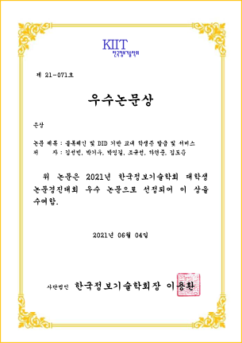
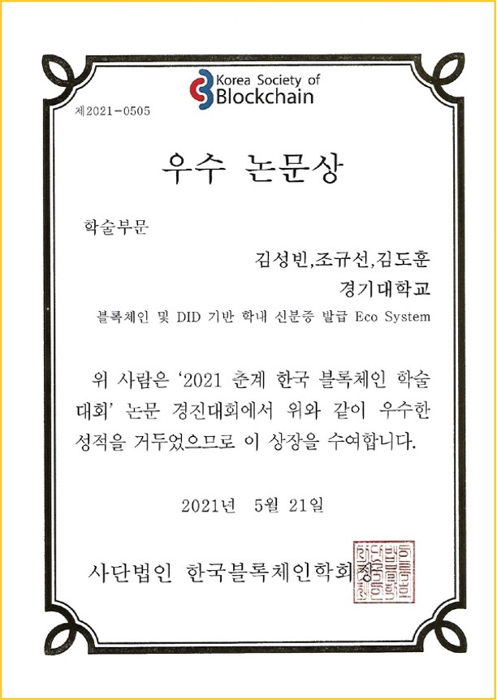
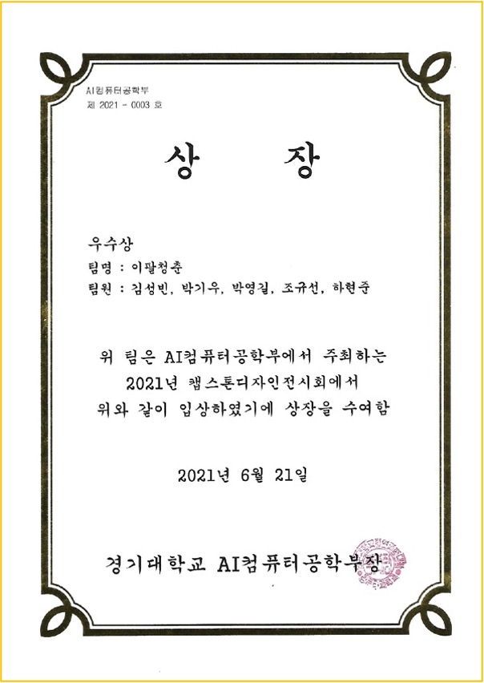
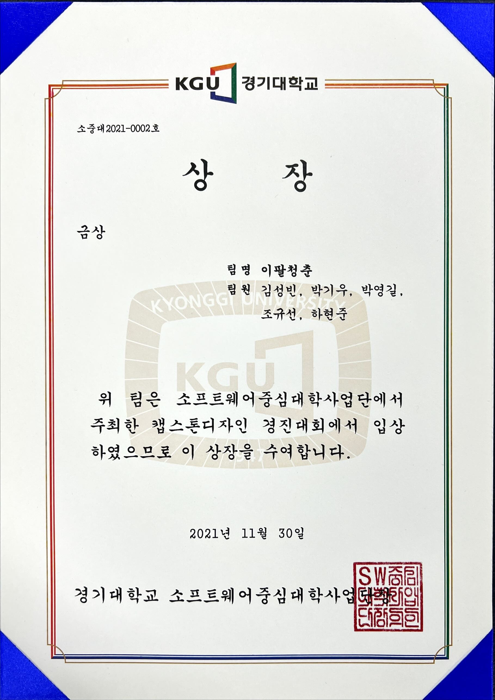

<!-- Main -->

<!-- One -->
<section id="one">
	

		<header class="major">
			<h1>Career</h1>
		</header>

<!-- Content -->
<h2 id="content">자기소개</h2>

	

		
		 
	

	

		<li>2016.03 경기대학교 컴퓨터공학부 입학</li>
		<li>2020.11 보안공학연구실 학부연구생</li>
		<li>2021.07 SW 저작권 등록 (진행중)</li>
		<li>2021.08 특허 등록 (진행중)</li>
		<li>2021.12 SW인재페스티벌 경기대학교 대표 참가</li>
		<li>2022.02 경기대학교 컴퓨터공학부 졸업예정</li>
		<li>2022.03 경기대학교 컴퓨터과학과 석사 입학</li>
	

	

	

		
안녕하세요. 저는 경기대학교 컴퓨터과학과 김성빈 입니다. 
		 저는 블록체인과 보안을 연구하고 있습니다. 
		 아래의 사항은 저의 연구 및 수상 실적입니다. 
		 문의가 있으시면 언제든 연락주시면 감사하겠습니다.
		

	

<h2>수상 실적</h2>

	

		

			

				<h3>한국정보기술학회 우수논문 은상 수상</h3>
				

				<li>Blockchain을 활용한 신원인증 플랫폼</li>
				<li>Hyperledger Indy와 Django, Vue.js 활용</li>
				<li>Blockchain Network - API Server - Web Server</li>
				

			

			

				
			

		

		

	

	

		

			

				<h3>한국블록체인학회 우수논문상 수상</h3>
				

				<li>Blockchain 및 DID를 활용한 네트워크 형성</li>
				<li>Hyperledger Indy의 Node를 Docker로 구현</li>
				<li>리소스와 속도를 개선하기 위한 확장성 및 유용성 연구</li>
				

			

			

				
			

		

		

	

	

		

			

				<h3>컴퓨터공학캡스톤디자인 우수상 수상</h3>
				

				<li>Blockchain을 활용한 신원인증 어플리케이션</li>
				<li>Hyperledger Indy와 Django, Vue.js 활용</li>
				<li>WebApp으로 패키징하여 배포</li>
				

			

			

				
			

		

		

	

	

		

			

				<h3>교내 캡스톤 우수작품 금상 수상</h3>
				

				<li>Blockchain을 활용한 신원인증 어플리케이션</li>
				<li>Hyperledger Indy와 Django, Vue.js 활용</li>
				<li>Blockchain Network - API Server - Web Server</li>
				<li>전시회를 통해 U-Pass의 동작과정 및 구현 설명</li>
				

			

			

				
			

		

		

	

